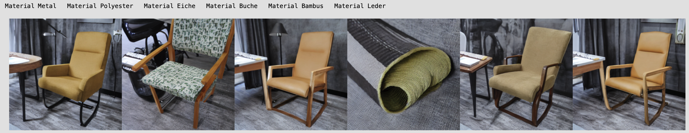
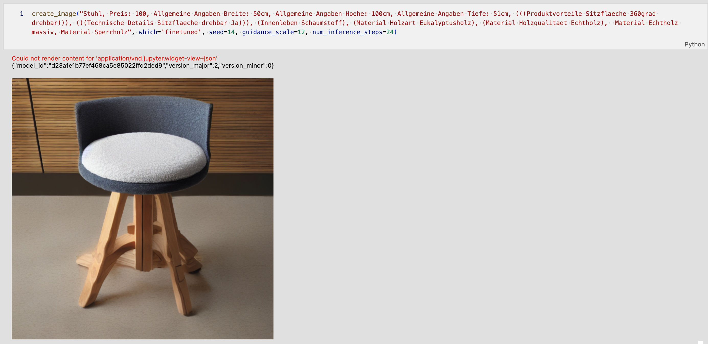
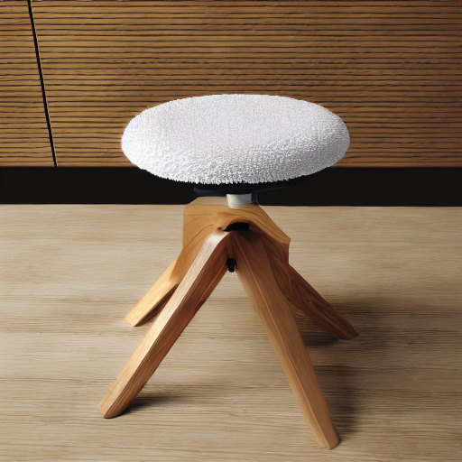
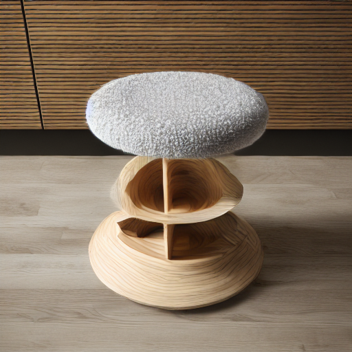
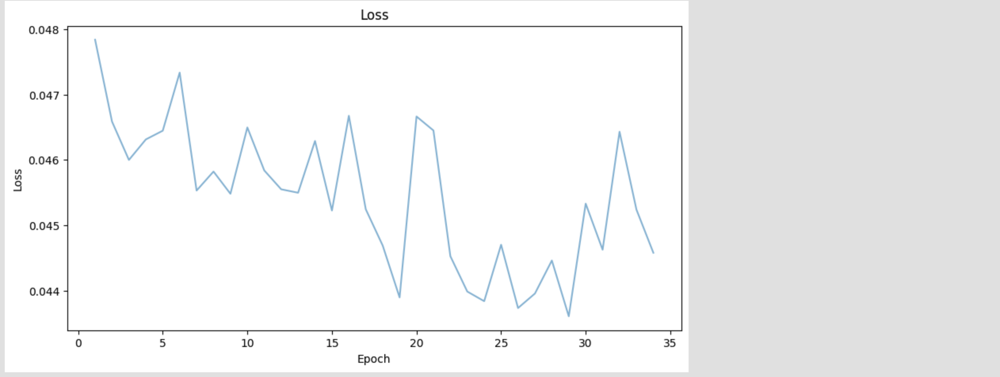

# StableChair Diffusion
In this notebook, a Stable Diffusion 1.5 model is finetuned on a scraped dataset which consists of chairs and their text descriptions (german text descriptions). Finetuning is successful in the sense that the finetuned model, in contrast to the base model, creates chairs easily when supplied with (german) text it has been finetuned on.   
We filter for images containing only one chair using llava-phi3 model. Although the llava-phi3 model is only 3 billion parameters it performs better than the llava1.6/llava-next model (7b) on this simple counting task. Paligemma (Google) is too slow.

The model works okay-ish. While it is a lot more simple to generate chairs, it has not yet generalized concepts like "material", "number of legs", "height/width", "sturdiness". Perhaps an increased dataset (>>6000 samples) and further training could help generalization.

``ChairStableDiffusion.ipynb`` contains the crawling, preprocessing and evaluation code. Issues and improvements are described at the end of the notebook.  
``Kaggle_training_script.ipynb`` is used for training the model.  
``captions.json`` contains the text descriptions to get a general idea which text the model has been trained on (and which can be used well in prompts)  
The model is available on huggingface: https://huggingface.co/EpsilonGreedy/StableChairs/ 
  
Base Stable Diffusion 1.5 model on top, finetuned model on bottom (Same prompt and seed):

  
Prompt adherence / generalization ability, dimension "material" (metal, polyester, oak, beech, bambus, leather):

  
My favorite chairs, containing the concept of "rotatable": 

  
Loss:

